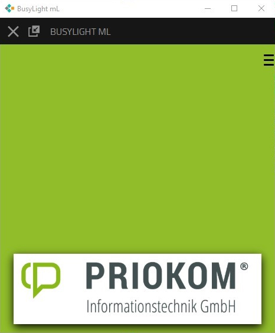
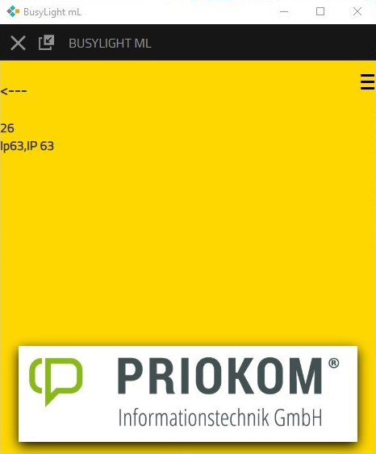
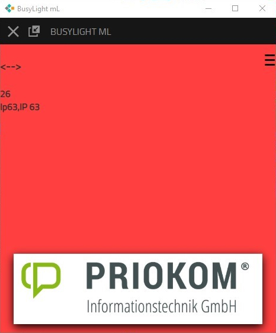
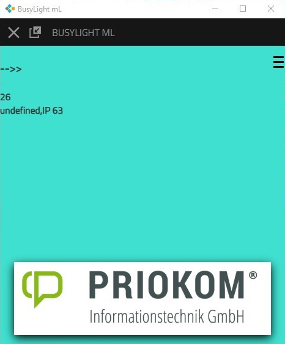

# busylight-docs

selfmade busylight  

raspi zero w/h   
eth hat  
ws2812 rgb led-hat  
running node-red  
  
and an app   
signaling in colors in the app and on the busylight  

in action  

idle greenish 

  
incoming gold  

  
call red  

  
outgoing pale cyan  

  
outgoing ringing cyan  
no coffecupimage here, but led's are cyan          
  

